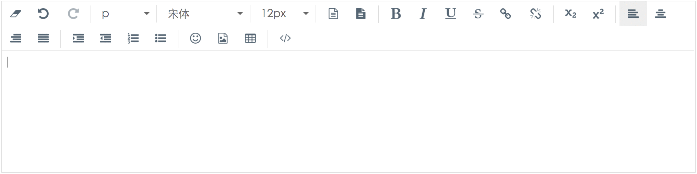

Vueditor
===

[](https://www.npmjs.com/package/vueditor)
[](https://www.npmjs.com/package/vueditor)

[English DOC](../README.md)

基于 Vue.js 和 Vuex.js 实现的富文本编辑器, 只支持 Vue.js 2.x.x

浏览器兼容性: Chrome, Firefox, Safari, IE 9+.

在线 [DEMO](http://hifarer.github.io/vueditor/)

## 截图



## 特性

- 可自定义
- 轻量级, 依赖少
- 插件支持

## 安装
```javascript
npm install vueditor
```

如果期望通过 script 标签引用, 只需添加 `vueditor.min.js`, `vueditor.min.css` 到相关页面即可. 

## 用法

### Vue.use(Vueditor, config)

适用于以下场景:

1. 只需一个编辑器的情况
2. 一个页面有多个编辑器但配置相同

```javascript
import Vue from 'vue'
import Vuex from 'vuex'
import Vueditor from 'vueditor'

import 'vueditor/dist/style/vueditor.min.css'

// 编辑器配置
let config = {
  toolbar: [
    'removeFormat', 'undo', '|', 'elements', 'fontName', 'fontSize', 'foreColor', 'backColor'
  ],
  fontName: [
    {val: 'arial black'}, 
    {val: 'times new roman'}, 
    {val: 'Courier New'}
  ],
  fontSize: ['12px', '14px', '16px', '18px', '0.8rem', '1.0rem', '1.2rem', '1.5rem', '2.0rem'],
  uploadUrl: ''
};

Vue.use(Vuex);
Vue.use(Vueditor, config);
// 创建根实例
new Vue({
  el: '#editorContainer'
});
```

然后在*.vue的template某一处:
```html
<template>
  <div>
    ...
    <Vueditor></Vueditor>
  </div>
</template>
```

获取和设置内容需要先拿到上一步`<Vueditor></Vueditor>`生成的组件，可以通过`$children[index]` 和 `ref`获取到。

```javascript
let parent = new Vue({
  el: '#editorContainer'
});
let inst = parent.$children[0];
inst.setContent('your content here');
inst.getContent();
```

### createEditor(selector, config)

`createEditor`适用于多个Vueditor实例，分别传参。

```javascript

  import Vue from 'vue'
  import Vuex from 'vuex'
  import {createEditor} from 'vueditor'

  import 'vueditor/dist/style/vueditor.min.css'
  
  Vue.use(Vuex);

  createEditor('#editorContainer', {
    toolbar: [
      'removeFormat', 'undo', '|', 'elements', 'fontName', 'fontSize', 'foreColor', 'backColor', 
    ],
    uploadUrl: '',
    id: '',
    classList: []
  });
```
注意这种用法会替换掉被初始化的那个元素，如果要添加样式到该元素可以在config里面加上`classList` 或 `id`来实现；`createEditor`返回一个Vueditor实例，通过该实例可以获取和设置内容:

```javascript
let inst = createEditor(...);
inst.setContent('your content here');
inst.getContent();
```

#### 文件上传
在初始化时可以指定一个地址用于上传文件，程序会自动处理上传过程。但是有时候需要在上传时进行一些如认证之类的操作，这时就需要自己来实现一个上传函数。给vueditor实例添加一个名叫`upload`的方法，当进行上传操作时将会调用该方法。该方法有两个参数，第一个是上传文件的input元素对象，第二个参数是一个回调函数，回调函数接受上传后的文件地址作为参数用以插入到编辑器，示例如下：
```javascript
editor.upload = function (obj, callback) {
  let formData = new FormData();
  let xhr = new XMLHttpRequest();
  formData.append('fieldName', obj.files[0]);
  xhr.open('POST', 'upload/url');
  xhr.send(formData);
  xhr.onload = function () {
    callback(xhr.responseText);
  };
  xhr.onerror = function (err) {
    console.log(err);
  }
}
```

### 界面语言

编辑器的默认语言为英语，如需设置成中文，需要引入`dist/language/lang.cn.js`, 使用script标签或者`import`, `require`都可以。引入以后在初始化编辑器作为配置的一部分传入，示例：
```javascript
Vue.use(Vueditor, {
  ...
  lang: languageObject,
});
```

## 可配置参数:

|          名称         |    类型    |                                                         描述                                                         |
| --------------------- | ---------- | --------------------------------------------------------------------------------------------------------------------------- |
| spellcheck            | `Boolean` | 是否打开拼写检查, 默认关闭 |
| toolbar               | `Array`   | 工具栏的按钮, 可用`|` or `divider` 做为分隔符 |
| fontName              | `Array`   | font-family 选项, `val` 为实际css值, `abbr` 为select-option显示的内容, `abbr` 等于 `val` 时可省略 |
| fontSize              | `Array`    | font-size 选项 |
| lang                  | `Object`   | 界面语言, 默认英文 |
| uploadUrl         | `String`   | 文件上传接口，返回值必须为字符串路径, 留空只进行本地预览 |
| id                    | `String`   | 容器id |
| classList             | `Array`    | 容器className |
| plugins             | `Array`    | 插件 |


以上可配置项的默认值

```javascript
{
  toolbar: [
    'removeFormat', 'undo', '|', 'elements', 'fontName', 'fontSize', 'foreColor', 'backColor', 'divider',
    'bold', 'italic', 'underline', 'strikeThrough', 'links', 'divider', 'subscript', 'superscript',
    'divider', 'justifyLeft', 'justifyCenter', 'justifyRight', 'justifyFull', '|', 'indent', 'outdent',
    'insertOrderedList', 'insertUnorderedList', '|', 'emoji', 'picture', 'tables', '|', 'switchView'
  ],
  fontName: [
    {val: 'arial black'}, 
    {val: 'times new roman'}, 
    {val: 'Courier New'}
  ],
  fontSize: [
    '12px', '14px', '16px', '18px', '20px', '24px', '28px', '32px', '36px'
  ],
  uploadUrl: ''
  id: '',
  classList: []
};
```

## 更新记录

查看[这里](./docs/changelog.md)

## Bug确认

## TODO

- [x] Markdown 支持
- [x] 全屏及工具栏固定选项
- [x] 弹出菜单位置自适应
- [ ] 表格高级设置
- [ ] 代码高亮
- [ ] 插件支持
- [ ] XSS 预防
- [ ] 测试

## License

[MIT](http://opensource.org/licenses/MIT)

Copyright (c) 2016 hifarer